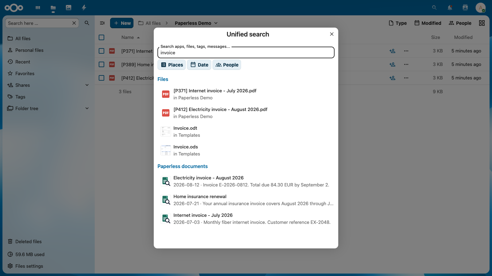
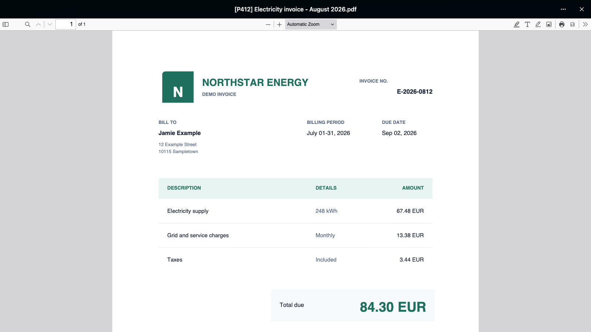
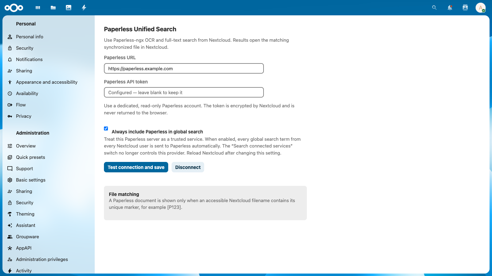

# Paperless Unified Search

[](https://github.com/Dennis-Otto/paperless-unified-search/actions/workflows/ci.yml)
[](https://github.com/Dennis-Otto/paperless-unified-search/actions/workflows/e2e.yml)
[](https://github.com/Dennis-Otto/paperless-unified-search/actions/workflows/secret-scan.yml)
[](https://github.com/Dennis-Otto/paperless-unified-search/actions/workflows/codeql.yml)
[](https://github.com/Dennis-Otto/paperless-unified-search/actions/workflows/sbom.yml)
[](https://scorecard.dev/viewer/?uri=github.com/Dennis-Otto/paperless-unified-search)

Paperless Unified Search brings Paperless-ngx OCR and full-text search into Nextcloud's global search. Search results open the matching synchronized file directly in Nextcloud's viewer.

## Screenshots

### Paperless results in Nextcloud's global search



### A search result opened in Nextcloud's PDF viewer



### Secure server-side administration



## How it works

1. Nextcloud forwards an enabled external-search query to Paperless-ngx.
2. Paperless returns results from its native OCR/full-text index.
3. The app maps each Paperless document ID to a synchronized Nextcloud filename containing the unique marker `[P<ID>]`, for example `[P123]`.
4. A result is returned only if the current Nextcloud user can access the matching file.
5. Selecting a result opens the synchronized file in Nextcloud, not Paperless. Browsers use Nextcloud's
   `/f/{fileId}` viewer route. The official iOS app receives its native `nextcloud://open-file` deep link,
   while Android receives the file ID and user-relative path required by its in-app viewer.

This app does not synchronize documents itself. For a native, configurable synchronization solution, use the companion [Paperless Sync](https://github.com/Dennis-Otto/paperless-sync) app. Both apps use the same stable `[P<ID>]` marker and are designed to work together without coupling their release cycles.

## Requirements

- Nextcloud 33 through 35
- PHP 8.2 or newer as supported by the corresponding Nextcloud release
- A reachable Paperless-ngx instance with API access
- Synchronized files whose names contain `[P<ID>]`

## Configuration

1. Create a dedicated Paperless account with the minimum read permissions required for document search.
2. Create an API token for that account.
3. In Nextcloud, open **Administration settings → Additional settings → Paperless Unified Search**.
4. Enter the Paperless base URL and API token.
5. Optionally enable **Always include Paperless in global search** to treat the configured Paperless server as trusted.
6. Select **Test connection and save**.

The configuration is global. Access control remains user-specific because the app discards every Paperless hit for which the searching Nextcloud user has no readable matching file.

By default, Nextcloud searches Paperless only after the user enables **Search connected services**. When the trusted-service option is enabled, every global search term from every Nextcloud user is sent to Paperless automatically and the connected-services switch no longer controls this provider. Reload Nextcloud after changing this option.

## Usage

Open Nextcloud's global search, enable **Search connected services**, and select **Paperless documents**. Nextcloud 32 and later disable external providers after a page reload, so this switch must be enabled again unless an administrator has enabled trusted-service mode.

Documents without a synchronized `[P<ID>]` file are intentionally omitted. This also keeps Inbox-only documents out of Nextcloud search when the synchronization process does not export them.

## Security and privacy

- The Paperless API token is stored only in Nextcloud's server-side credentials manager.
- The token is never returned to browser JavaScript or rendered into HTML.
- Search results are filtered through the current user's Nextcloud filesystem view.
- Search terms are sent server-to-server only when connected-services search or trusted-service mode is enabled.
- Administrators can explicitly trust the configured Paperless server to include it automatically in every user's global searches.
- No deployment credentials, private hostnames, internal addresses, or instance configuration belong in this repository.
- Gitleaks scans every push and pull request.
- Dependency Review blocks newly introduced vulnerable or unapproved dependencies.
- Psalm analyzes the PHP code and CodeQL scans the JavaScript on every pull request.
- Every release includes an SPDX SBOM, a detached signature, and public Sigstore build provenance.
- OpenSSF Scorecard audits the repository's supply-chain security every week.

See [SECURITY.md](SECURITY.md) for reporting security issues.

## Development

Install dependencies and run all checks:

```bash
composer install
composer lint
composer l10n:check
composer test
composer cs:check
composer psalm
composer version:check
```

The production archive intentionally excludes tests, release tools, Composer development dependencies, screenshots, and repository metadata. Packaging uses [Krankerl](https://github.com/ChristophWurst/krankerl), and `composer package:check` validates the finished archive.

### Docker end-to-end tests

The Docker suite starts a clean Nextcloud instance with the app mounted as a Custom App and a deterministic Paperless API mock. It exercises the real OCS search endpoint, user-specific file access, trusted-service metadata, and browser/iOS/Android result contracts.

```bash
bash tests/e2e/run.sh
```

Set `KEEP_E2E=1` to leave the containers running for inspection. See [the mobile test matrix](tests/e2e/MANUAL_MOBILE_TESTS.md) for the final checks performed with official clients.

See [CONTRIBUTING.md](CONTRIBUTING.md) before opening a pull request.

### Releases

The protected `main` branch accepts changes only through pull requests after CI, dependency review, Docker E2E, CodeQL, SBOM generation, and secret scanning succeed. Dependabot checks Composer, GitHub Actions, and Docker Compose weekly. Grouped patch and minor updates are queued for automatic squash merge only after those protected checks pass; Nextcloud major compatibility changes and releases remain manual. Dependency maintenance never starts a release.

Add user-visible changes to the `Unreleased` section in [CHANGELOG.md](CHANGELOG.md). To publish, manually run the **Release** workflow from the default branch and choose `patch`, `minor`, or `major`. The workflow then:

1. Runs the complete quality and secret checks.
2. Calculates and validates the next semantic version.
3. Updates app metadata, versioned screenshot URLs, and the changelog.
4. Creates a signed-off `release/vX.Y.Z` commit and opens a protected pull request.
5. Dispatches CI, dependency review, Docker E2E, and secret scanning for the release branch and waits for GitHub auto-merge.
6. Builds and signs the exact merged release commit and creates a detached archive signature and SPDX SBOM.
7. Creates public Sigstore provenance covering the signed archive, detached signature, and SBOM.
8. Tags the merged commit, publishes every verification asset in the GitHub release, and updates the Nextcloud App Store release.

An interrupted run resumes the existing release branch, merged release PR, tag, or incomplete GitHub release instead of incrementing again. `composer version:check` verifies version consistency locally and in CI.

Project decisions and support expectations are documented in [GOVERNANCE.md](GOVERNANCE.md), [SUPPORT.md](SUPPORT.md), and [CODE_OF_CONDUCT.md](CODE_OF_CONDUCT.md).

## License

AGPL-3.0-or-later. See [LICENSE](LICENSE).
