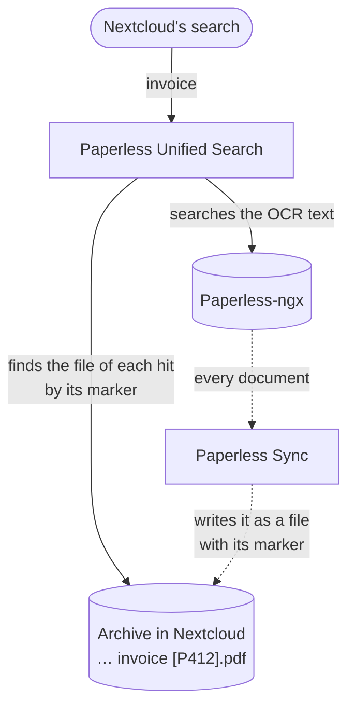
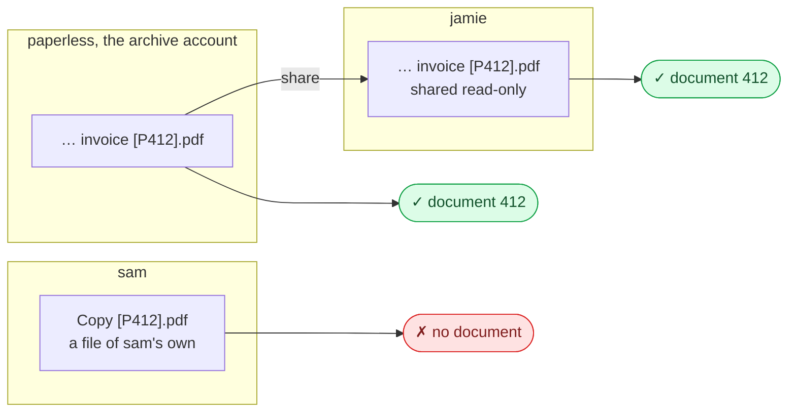

# Paperless Unified Search

[](https://dennis-otto.github.io/paperless-unified-search/)
[](https://github.com/Dennis-Otto/paperless-unified-search/actions/workflows/ci.yml)
[](https://github.com/Dennis-Otto/paperless-unified-search/actions/workflows/e2e.yml)
[](https://github.com/Dennis-Otto/paperless-unified-search/actions/workflows/secret-scan.yml)
[](https://github.com/Dennis-Otto/paperless-unified-search/actions/workflows/codeql.yml)
[](https://github.com/Dennis-Otto/paperless-unified-search/actions/workflows/sbom.yml)
[](https://scorecard.dev/viewer/?uri=github.com/Dennis-Otto/paperless-unified-search)
[](https://www.bestpractices.dev/projects/14256)
[](https://api.reuse.software/info/github.com/Dennis-Otto/paperless-unified-search)
[](https://github.com/sponsors/Dennis-Otto)

Paperless Unified Search brings Paperless-ngx OCR and full-text search into Nextcloud's global search. Search results open the matching synchronized file directly in Nextcloud's viewer.


<sub>The search of files finds the two invoices by their names. Paperless also finds the home insurance renewal: its text says "invoice", its name doesn't.</sub>

The [documentation website](https://dennis-otto.github.io/paperless-unified-search/) has this documentation as a guide, together with the architecture, the security design and the roadmap.

<sub>💛 If Paperless Unified Search is useful to you, you can [support its development](https://github.com/sponsors/Dennis-Otto).</sub>

[Quick start](#quick-start) · [Architecture](https://github.com/Dennis-Otto/paperless-unified-search/blob/main/docs/architecture.md) · [Security design](https://github.com/Dennis-Otto/paperless-unified-search/blob/main/docs/security.md) · [Roadmap](https://github.com/Dennis-Otto/paperless-unified-search/blob/main/docs/roadmap.md) · [Releases](https://github.com/Dennis-Otto/paperless-unified-search/blob/main/docs/releases.md) · [Changelog](https://github.com/Dennis-Otto/paperless-unified-search/blob/main/CHANGELOG.md)

<!-- --8<-- [start:quick-start-section] -->

## Quick start

<!-- --8<-- [start:quick-start] -->

1. Install **Paperless Unified Search** from the [Nextcloud App Store](https://apps.nextcloud.com/apps/paperless_unified_search) under *Apps*, or with `occ app:install paperless_unified_search`.
2. In Paperless-ngx, create an account that may read the documents to search, and an API token for it.
3. In Nextcloud, open **Administration settings → Paperless Unified Search**, enter the Paperless URL and the token, and select **Test connection and save**. With [Paperless Sync](https://github.com/Dennis-Otto/paperless-sync) installed, the account it writes the archive with is the **Archive account**; otherwise enter the account that owns the synchronized files.
4. Search in Nextcloud, switch on **Search connected services** and look under **Paperless documents**. A result appears for every document whose synchronized file you can open: a file of the archive account with `[P<ID>]` in its name, your own if you are that account, or one it shared with you. [Paperless Sync](https://github.com/Dennis-Otto/paperless-sync) creates such files.

<!-- --8<-- [end:quick-start] -->

[Configuration](#configuration) and [Usage](#usage) have the details.

<!-- --8<-- [end:quick-start-section] -->

## Screenshots

Every picture but those of the phone has a dark version, which a dark theme shows.

### Paperless results in Nextcloud's global search

<picture>
  <source media="(prefers-color-scheme: dark)" srcset="https://github.com/Dennis-Otto/paperless-unified-search/raw/main/screenshots/01-unified-search-dark.png">
  
</picture>

### A search result opened in Nextcloud's PDF viewer

<picture>
  <source media="(prefers-color-scheme: dark)" srcset="https://github.com/Dennis-Otto/paperless-unified-search/raw/main/screenshots/02-nextcloud-pdf-viewer-dark.png">
  
</picture>

### On a phone

<p>
  
  
</p>

Nextcloud in the browser of a phone. The Nextcloud apps for iOS and Android open a result in their own viewer.

### Secure server-side administration

<picture>
  <source media="(prefers-color-scheme: dark)" srcset="https://github.com/Dennis-Otto/paperless-unified-search/raw/main/screenshots/03-admin-settings-dark.png">
  
</picture>

### Problems of the search

<picture>
  <source media="(prefers-color-scheme: dark)" srcset="https://github.com/Dennis-Otto/paperless-unified-search/raw/main/screenshots/06-search-problems-dark.png">
  
</picture>

The end of the settings counts the failed searches and the requests that only their second try answered, and lists the latest of them with their errors, also where the hoster keeps the log of Nextcloud from administrators.

<!-- --8<-- [start:how-it-works] -->

## How it works


```mermaid
flowchart TB
    search(["Nextcloud's search"]) -- "invoice" --> app["Paperless Unified Search"]
    app -- "searches the OCR text" --> paperless[("Paperless-ngx")]
    app -- "finds the file of each hit<br/>by its marker" --> archive[("Archive in Nextcloud<br/>… invoice [P412].pdf")]
    paperless -. "every document" .-> sync["Paperless Sync"]
    sync -. "writes it as a file<br/>with its marker" .-> archive
```

1. Nextcloud forwards an enabled external-search query to Paperless-ngx.
2. Paperless returns results from its native OCR/full-text index.
3. The app maps each Paperless document ID to a synchronized file of the archive account whose name contains the unique marker `[P<ID>]`, for example `[P123]`. The archive account is the one that owns the synchronized files: the account of Paperless Sync, or the one of the settings.
4. A result is returned only if the current Nextcloud user can access that file: the archive account itself, or a user it shared the file with. A file with the marker in its name that belongs to another account stands for no document.
5. Selecting a result opens the synchronized file in Nextcloud, not Paperless. Browsers use Nextcloud's
   `/f/{fileId}` viewer route. The official iOS app receives its native `nextcloud://open-file` deep link,
   while Android receives the file ID and user-relative path required by its in-app viewer.

Who sees document 412, when `paperless` is the archive account and has shared its archive with `jamie`:


```mermaid
flowchart LR
    subgraph owner["paperless, the archive account"]
        own["… invoice [P412].pdf"]
    end
    subgraph reader["jamie"]
        shared["… invoice [P412].pdf<br/>shared read-only"]
    end
    subgraph other["sam"]
        copy["Copy [P412].pdf<br/>a file of sam's own"]
    end
    own -- "share" --> shared
    own --> seen1(["✓ document 412"])
    shared --> seen2(["✓ document 412"])
    copy --> unseen(["✗ no document"])
    classDef yes fill:#dcfce7,stroke:#16a34a,color:#14532d
    classDef no fill:#fee2e2,stroke:#dc2626,color:#7f1d1d
    class seen1,seen2 yes
    class unseen no
```

This app does not synchronize documents itself. For a native, configurable synchronization solution, use the companion [Paperless Sync](https://github.com/Dennis-Otto/paperless-sync) app. Both apps use the same stable `[P<ID>]` marker and are designed to work together without coupling their release cycles.

<!-- --8<-- [end:how-it-works] -->
<!-- --8<-- [start:requirements] -->

## Requirements

- Nextcloud 33 through 35
- PHP 8.2 or newer as supported by the corresponding Nextcloud release
- A reachable Paperless-ngx instance with API access
- Synchronized files whose names contain `[P<ID>]`, owned by one Nextcloud account, for example those of Paperless Sync

<!-- --8<-- [end:requirements] -->
<!-- --8<-- [start:configuration] -->

## Configuration

1. Create a dedicated Paperless account with the minimum read permissions required for document search.
2. Create an API token for that account.
3. In Nextcloud, open **Administration settings → Paperless Unified Search**.
4. Enter the Paperless base URL and API token.
5. Under **Archive account**, enter the Nextcloud account that owns the synchronized files, or leave it blank to use the account that Paperless Sync writes the archive with.
6. Optionally enable **Always include Paperless in global search** to treat the configured Paperless server as trusted.
7. Select **Test connection and save**.

The configuration is global. Access control remains user-specific because the app discards every Paperless hit for which the searching Nextcloud user can't open a matching file of the archive account. Share the archive read-only with the users who may see its documents. Without an archive account, the search shows no Paperless documents.

When Paperless documents are missing from the search, look at **Search problems** at the end of the settings. A failed search shows the users no Paperless documents and no error, and a request to Paperless that gets no answer at all, as when the connection fails, is sent a second time before the search gives up. The settings count both, the failed searches and the requests that only their second try answered, and list the latest 20 with the time, the step, asking Paperless or looking for the files in Nextcloud, the kind and the message of the error and how long it took, along with since when searches work again after the last failure. This helps where the hoster keeps the log of Nextcloud from administrators. **Clear history** and **Disconnect** forget the history; saving the settings keeps it.

By default, Nextcloud searches Paperless only after the user enables **Search connected services**. When the trusted-service option is enabled, every global search term from every Nextcloud user is sent to Paperless automatically and the connected-services switch no longer controls this provider. Reload Nextcloud after changing this option.

<!-- --8<-- [end:configuration] -->
<!-- --8<-- [start:usage] -->

## Usage

Open Nextcloud's global search, enable **Search connected services**, and select **Paperless documents**. Nextcloud 32 and later disable external providers after a page reload, so this switch must be enabled again unless an administrator has enabled trusted-service mode.

Documents without a synchronized `[P<ID>]` file of the archive account are intentionally omitted. This also keeps Inbox-only documents out of Nextcloud search when the synchronization process does not export them.

<!-- --8<-- [end:usage] -->
<!-- --8<-- [start:security-and-privacy] -->

## Security and privacy

- The Paperless API token is stored only in Nextcloud's server-side credentials manager.
- The token is never returned to browser JavaScript or rendered into HTML.
- Search results are filtered through the current user's Nextcloud filesystem view.
- The settings show administrators the history of the problems of the search without the API token, the search term or the query of any URL.
- Search terms are sent server-to-server only when connected-services search or trusted-service mode is enabled.
- Administrators can explicitly trust the configured Paperless server to include it automatically in every user's global searches.
- No deployment credentials, private hostnames, internal addresses, or instance configuration belong in this repository.
- Gitleaks scans every push and pull request.
- Dependency Review blocks newly introduced vulnerable or unapproved dependencies.
- Psalm analyzes the PHP code and CodeQL scans the JavaScript on every pull request.
- Every release includes an SPDX SBOM, a detached signature, and public Sigstore build provenance.
- OpenSSF Scorecard audits the repository's supply-chain security every week.

See [SECURITY.md](https://github.com/Dennis-Otto/paperless-unified-search/blob/main/SECURITY.md) for reporting security issues.

<!-- --8<-- [end:security-and-privacy] -->

## Development

Install the dependencies and run every check of the CI; the dev container in `.devcontainer/` has the tools ready:

```bash
composer install
bash scripts/check.sh
```

`scripts/check.sh` checks Composer, `appinfo/info.xml` against the schema of the App Store, PHP syntax, the coding standard, Psalm, PHPUnit, the package that krankerl builds with `scripts/check-package.sh`, and the JavaScript and the translations (`scripts/check-project.sh`).

The production archive intentionally excludes tests, release tools, Composer development dependencies, screenshots, and repository metadata. Packaging uses [Krankerl](https://github.com/ChristophWurst/krankerl), and `scripts/check-package.sh` validates the finished archive.

### Docker end-to-end tests

The Docker suite starts a clean Nextcloud instance with the app mounted as a Custom App and a deterministic Paperless API mock. It exercises the real OCS search endpoint, user-specific file access, trusted-service metadata, and browser/iOS/Android result contracts.

```bash
bash tests/e2e/run.sh
```

Set `KEEP_E2E=1` to leave the containers running for inspection. See [the mobile test matrix](https://github.com/Dennis-Otto/paperless-unified-search/blob/main/tests/e2e/MANUAL_MOBILE_TESTS.md) for the final checks performed with official clients.

### Screenshots

The screenshots and the animation in `screenshots/` come from a script, so that they show what users see. After a change of the interface, take them again:

```bash
bash scripts/screenshots.sh
```

It starts the Docker suite under a project of its own with a demo: the archive account `paperless`, whose synthetic documents are shared read-only with `jamie`, and a Paperless mock that finds three of them for "invoice". Chromium then searches, opens a result and saves the settings, light and dark, on a phone and as an animation. Set `KEEP_SCREENSHOTS=1` to look around in the demo afterwards.

See [CONTRIBUTING.md](https://github.com/Dennis-Otto/paperless-unified-search/blob/main/CONTRIBUTING.md) before opening a pull request.

### Releases

The protected `main` branch requires the checks of the CI, the Docker end-to-end tests against every supported Nextcloud version, the dependency review, CodeQL, the secret scan, the licenses of every file (REUSE), the sign-off of every commit and a Conventional Commit title. Dependabot keeps the dependencies current; routine updates merge on their own once every check passes.

The release bot keeps a pull request for the next release. Its version follows from the titles of the merged pull requests, and what they wrote under *Unreleased* in `CHANGELOG.md` becomes its notes. Merging it publishes the release: the package, checked before and after signing with the app's certificate, its detached signature, an SPDX SBOM and signed build provenance, then the same package in the Nextcloud App Store, verified afterwards as users can verify it. See [the release guide](https://github.com/Dennis-Otto/paperless-unified-search/blob/main/docs/releases.md).

Project decisions and support expectations are documented in [GOVERNANCE.md](https://github.com/Dennis-Otto/paperless-unified-search/blob/main/GOVERNANCE.md), [SUPPORT.md](https://github.com/Dennis-Otto/paperless-unified-search/blob/main/SUPPORT.md), and [CODE_OF_CONDUCT.md](https://github.com/Dennis-Otto/paperless-unified-search/blob/main/CODE_OF_CONDUCT.md).

## License

AGPL-3.0-or-later. See [LICENSE](https://github.com/Dennis-Otto/paperless-unified-search/blob/main/LICENSE).
