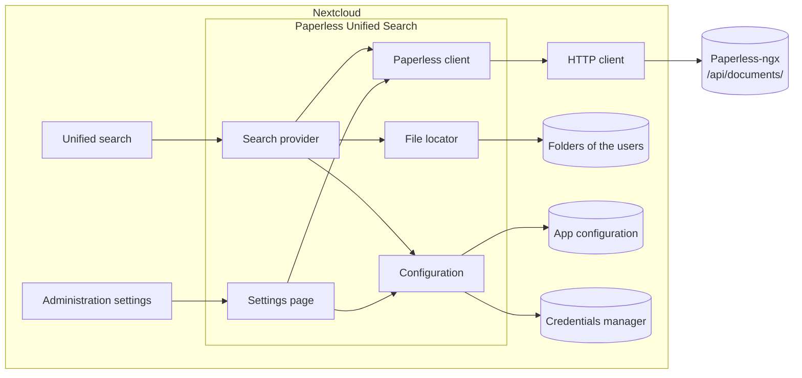
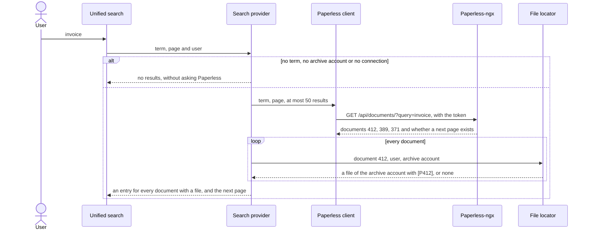
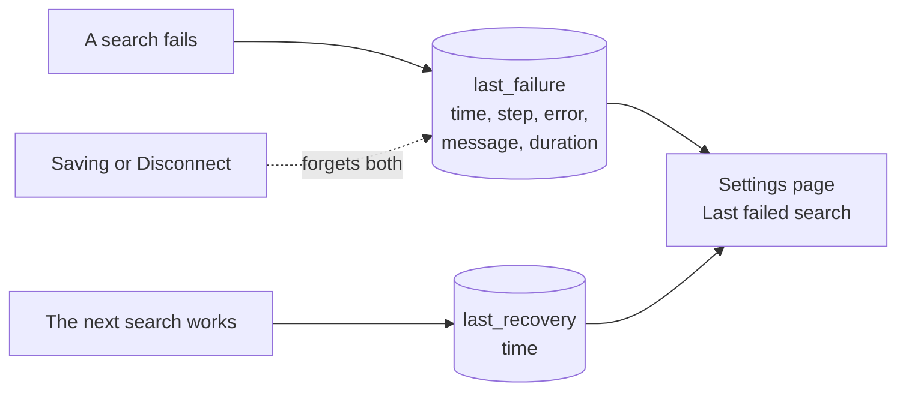
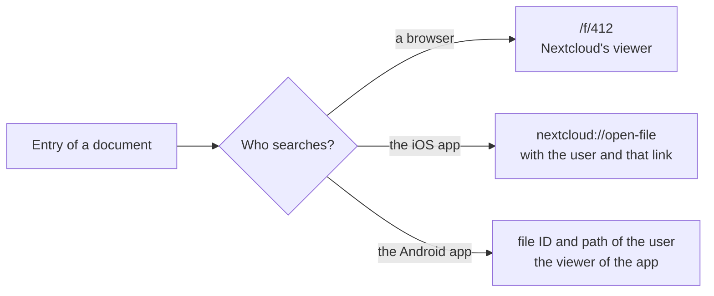
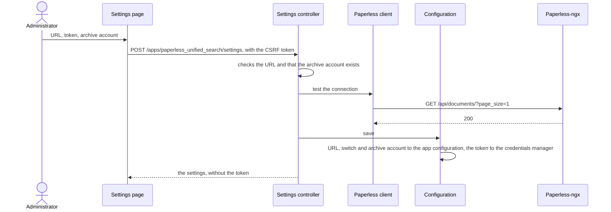

# Architecture

[← README](https://github.com/Dennis-Otto/paperless-unified-search) · [Security design](security.md) · [Roadmap](roadmap.md) · [Releases](releases.md)

Paperless Unified Search is a Nextcloud app in PHP. It adds a provider to Nextcloud's unified search that asks Paperless-ngx and shows the documents whose synchronized files the searching user can read. It stores no documents and no index of its own, and has no server, daemon or port of its own.

## Components

| Component | Files | What it does |
| --- | --- | --- |
| App | `lib/AppInfo/Application.php` | Registers the search provider with Nextcloud |
| Search provider | `lib/Search/PaperlessSearchProvider.php` | Answers a search of Nextcloud: asks Paperless, keeps the results with a readable file and builds each entry with its title, an excerpt and the link that opens the file in the browser, the iOS app or the Android app |
| Paperless client | `lib/Service/PaperlessApiService.php` | Sends the search term to the full-text search of Paperless through Nextcloud's HTTP client and checks the shape of the answer |
| File locator | `lib/Service/NextcloudFileLocator.php` | Finds the file of the archive account whose name carries the marker `[P<ID>]` of a document in the folders that the searching user can read |
| Configuration | `lib/Service/ConfigService.php`, `lib/Model/PublicConfig.php` | Checks and stores the URL of Paperless, the archive account and the switch *Always include Paperless in global search*; the API token goes to Nextcloud's credentials manager; without an archive account of its own it takes the account of Paperless Sync |
| Settings page | `lib/Settings/`, `lib/Controller/SettingsController.php`, `templates/settings.php`, `js/settings.js` | The page under *Administration settings → Paperless Unified Search*, a section of its own: save after a test of the connection, and reset; Nextcloud lets only administrators call its routes and checks the CSRF token of every request |

## Data flow

1. A user searches in Nextcloud. Nextcloud asks the provider when the user has switched on *Search connected services*, or always when an administrator has marked Paperless as trusted.
2. The provider sends the term to the full-text search of Paperless, at most 50 results per page.
3. For every document of the answer, the file locator looks for a file of the archive account with the marker `[P<ID>]` in the folders of the searching user. A document without such a file is left out, and without an archive account Paperless isn't asked at all.
4. Each remaining document becomes an entry: its title, the date and an excerpt of the text that Paperless found, and the link that opens the file in Nextcloud. Further pages of Paperless become further pages of the search.
5. A request to Paperless that gets no answer at all, because the name of the host doesn't resolve or the connection fails or times out, is sent a second time. An answer of Paperless, whatever its status, is not.
6. A search that still fails returns no results, as an empty search does. The provider logs the kind of error and remembers the failure for the administration settings: the time, the step, asking Paperless or looking for the files, the kind and the message of the error, and how long it took. The first search that works afterwards notes when searches work again.

## Diagnostics

Users see no difference between a failed search and one without documents, and some hosters keep the log of Nextcloud from administrators. So the settings page shows the last failed search under *Last failed search*.

Both values live in the app configuration of Nextcloud and are loaded only when they are needed. The message loses the API token, the search term when it has at least three characters, cURL's pointer to the page of its error codes, and the query and the fragment of every URL, and is cut to 300 characters. A search that works writes only once after a failure, so searches that keep working write nothing.

## Opening a result

The link of an entry depends on who searches, which the provider tells from the user agent of the request:

Every entry carries the ID of the file and its path in the folders of the user as well; the Android app opens the file with them.

## Saving the settings

A token left blank keeps the stored one. *Disconnect* deletes every setting, the token included. Both forget the last failed search, which says nothing about the settings that follow.

## Design decisions

- **Nextcloud decides who sees a file.** The app shows a document only through a file that the searching user can read in Nextcloud, and opens that file, not Paperless.
- **Paperless does the searching.** Its OCR and full-text index answer the search; the app keeps no index of its own.
- **The marker `[P<ID>]`** in the file name ties a file of the archive account to its document. [Paperless Sync](https://github.com/Dennis-Otto/paperless-sync) writes such files, and the two apps work together without depending on each other's releases.
- **The owner, not the name, decides.** Only files of the archive account count, because anyone can give a file the marker of a document ([decision 0002](decisions/0002-trust-the-archive-account.md)).
- **External by default.** Like every provider that sends search terms to another server, the app searches Paperless only when the user asks for it, unless an administrator marks Paperless as trusted.
