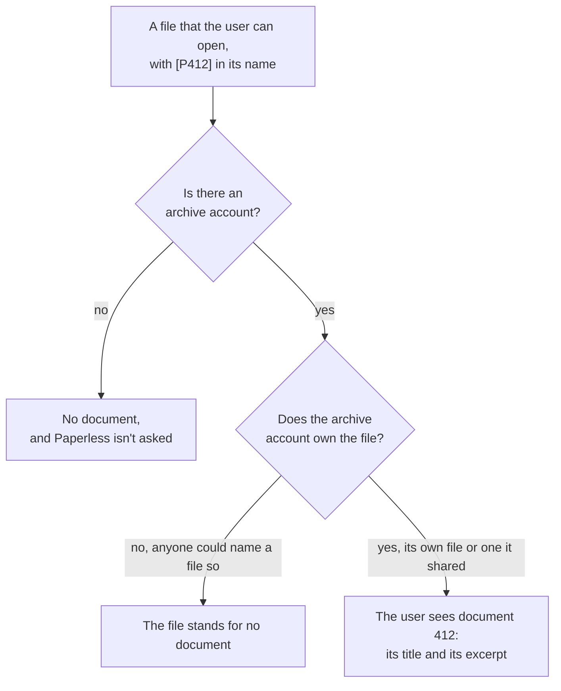

# Trust the owner of a file, not its name

- Status: accepted
- Date: 2026-10-08

## Context

A Paperless document appears in the search of a user through a Nextcloud file whose name carries its marker `[P<ID>]`. The app asks Paperless with the token of the administrator, so it can find every document. Anyone can give a file such a name, so the name alone can't decide who may see the title and the excerpt of a document.

## Options

1. Keep trusting the name.
2. Count only files of one account, the archive account, which owns the synchronized files; other users see them only through its shares.
3. Check every file against the records of Paperless Sync.
4. Check that the content of the file is the document, by its checksum.
5. Give every user a Paperless token of their own.

## Decision

Option 2. The archive account is the one of the settings, or else the account that Paperless Sync writes the archive with, read from its app configuration. Without an archive account, the search shows no documents.

## Consequences

Nextcloud's shares stay the only way to give access, as for the files themselves, and the apps stay independent of each other's releases: option 3 would tie the app to the database of Paperless Sync, option 4 would read every file and ask Paperless once more for each result, and option 5 would need a Paperless account for every user. Whoever may write into a folder of the archive account can still give a file of that account the marker of any document, so the archive should be shared read-only.
