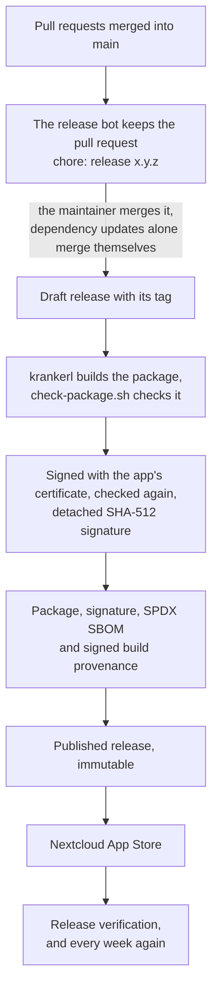

# Releases

Releases follow the [repository blueprint](https://github.com/Dennis-Otto/repo-blueprint): nobody chooses a version or writes release notes by hand.

## The release pull request

Every pull request that changes something for users describes it under `## Unreleased` in `CHANGELOG.md`. The release bot (`.github/workflows/release.yml`) keeps a pull request titled `chore: release x.y.z` up to date with `main`:

- **The version** follows from the titles of the pull requests merged since the last release: `fix` makes a patch, `feat` a minor and `!` or `BREAKING CHANGE` a major version. Every merge decides it anew. A line `Release-As: x.y.z` in the description of a pull request sets it explicitly.
- **The changelog:** the text of *Unreleased* becomes the section of the release; without one, the section lists the pull requests.
- **The files of the version:** `appinfo/info.xml` (`<version>` and the screenshot URLs marked `x-release-please-version`), `version.txt` and `.release-please-manifest.json`.

The pull request needs the same required checks as every other one, the Docker end-to-end tests against every supported Nextcloud version included. A release of dependency updates alone merges itself; every other release waits for the maintainer to merge it.

## Publication

Merging the release pull request creates the release as a draft, with its tag, and then:

1. krankerl builds the package of the tagged commit; `scripts/check-package.sh` checks what it holds.
2. The package is signed with the app's certificate (`occ integrity:sign-app`) and checked again, and a detached SHA-512 signature is made and verified with the public key of the certificate.
3. The release gets the package `paperless_unified_search.tar.gz`, its signature `paperless_unified_search.tar.gz.sig`, an SPDX SBOM, and the signed build provenance of every asset (`provenance.sigstore.json` and `provenance.intoto.jsonl`).
4. The complete release is published; GitHub keeps it immutable from then on.
5. The same package is submitted to the Nextcloud App Store.
6. The release verification (`.github/workflows/verify-release.yml`) checks the release as its users can: every attestation, the SBOM, the immutability, the signed commit, and the version in the App Store. It checks the latest release every week as well.

## Secrets and recovery

The `release` environment allows only `main`. It holds `APP_PRIVATE_KEY` (the key of the app's certificate), `APPSTORE_TOKEN` and `RELEASE_AUTOMATION_PRIVATE_KEY` (the release app, whose client ID is the repository variable `RELEASE_AUTOMATION_CLIENT_ID`). Every token is short-lived and scoped to what its job needs.

If a job fails, re-run the failed jobs of the Release workflow: a draft is completed, and the App Store accepts the same version again without a second release. A published release is never replaced.

Registering the app in the App Store, needed once and again only for a new certificate, is the manual workflow *Register app in Nextcloud App Store*.
