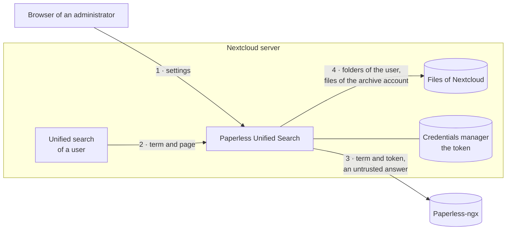

# Security design

[← README](https://github.com/Dennis-Otto/paperless-unified-search) · [Architecture](architecture.md) · [Roadmap](roadmap.md) · [Releases](releases.md)

What Paperless Unified Search protects, what it trusts and which risks remain. [SECURITY.md](https://github.com/Dennis-Otto/paperless-unified-search/blob/main/SECURITY.md) says how to report a vulnerability and how to verify a release, and argues why the repository and its releases are safe.

## What you can expect

- Only administrators of Nextcloud can see and change the settings. Every request passes Nextcloud's login and its CSRF check.
- The Paperless API token is stored in Nextcloud's credentials manager and never leaves the server: no response, page or message of the app contains it.
- A Paperless document appears in the results of a user only when that user can open a file of the archive account whose name carries its marker `[P<ID>]`: their own if they are that account, or one it shared with them. A file that only carries the marker in its name stands for no document. Selecting the result opens that file in Nextcloud.
- Search terms reach Paperless only when the user switches on *Search connected services*, or when an administrator has marked Paperless as trusted. They travel from server to server, never from the browser to Paperless.
- Requests to Paperless go through Nextcloud's HTTP client, which checks TLS certificates.
- A failed search is logged with the kind of error only, without the term, the URL or the token.

## What is protected

| Asset | Where it lives | Protection |
| --- | --- | --- |
| The Paperless API token | Nextcloud's credentials manager | Stored only there; the settings carry only whether a token is configured; saving without a new token keeps the stored one |
| The search terms of the users | Sent to Paperless | Only when the user asks for it or an administrator trusts Paperless; never logged by the app |
| Documents in Paperless | Paperless | Read through a dedicated account with read access only; shown only through a file of the archive account that the user can read |
| The configuration | Nextcloud's app configuration | Changed only by administrators, after a test of the connection |

## Trust boundaries

1. **Browser → app.** The routes of the settings page pass Nextcloud's login, its CSRF check and the check of the administrator. The URL must use `http` or `https` and carry no credentials, query or fragment.
2. **Nextcloud's search → app.** The term and the cursor of a page come from the user: the cursor must be a number, and a page holds at most 50 results.
3. **App → Paperless.** Every answer is untrusted input. It must be JSON with a list of results; a document without a numeric ID is left out; titles and dates are used only when they are text; the excerpt loses every HTML tag and is cut to 180 characters.
4. **App → files of Nextcloud.** The file locator searches only the folders of the searching user, with Nextcloud's permissions, and takes only files, never folders, and only those that the archive account owns. The marker in a name is chosen by whoever names the file and proves nothing by itself; the files of the archive account reach other users only through its shares.

## Threats and countermeasures

| Threat | Countermeasure | Evidence |
| --- | --- | --- |
| Another site uses the session of an administrator | Nextcloud checks the CSRF token of every request; no route of the app opts out of it or of the check of the administrator | the controller in `lib/Controller/`, which carries no `NoCSRFRequired`, `NoAdminRequired` or `PublicPage` attribute |
| The API token reaches the browser | The token stays in the credentials manager; the settings carry only whether one is configured | `testPublicConfigNeverContainsToken` in `tests/Unit/Service/ConfigServiceTest.php` |
| A malformed or hostile answer of Paperless | The answer is checked for its shape; documents without a usable ID are left out; a failing search returns no results instead of an error | `testAWrongAnswerOfPaperlessFails`, `testDocumentsWithoutAUsableIdAreLeftOut`, `testAFailedSearchIsLoggedWithoutItsDetails` |
| Text of a document runs as script in the search | The excerpt loses every HTML tag; Nextcloud's search shows titles and excerpts as text | `testTitleAndSublineComeFromTheDocument` in `tests/Unit/Search/PaperlessSearchProviderTest.php` |
| A user names a file with the marker of a document that they may not see | Only files that the archive account owns stand for documents, and users receive them only through its shares; without an archive account the search shows no documents and doesn't ask Paperless | `testIgnoresFilesThatTheArchiveAccountDoesNotOwn`, `testAFileOfAnotherAccountShowsNoDocument`, `testWithoutAnArchiveAccountPaperlessIsNotAsked`, and the forged file of the end-to-end tests |
| A slow Paperless blocks the search | A connection timeout of 3 seconds and a timeout of 10 seconds for every request | `lib/Service/PaperlessApiService.php` |

The Docker end-to-end tests run the real search endpoint of every supported Nextcloud version against a mock of the Paperless API, with users who may and may not read a file, a file that only carries the marker and a share of the archive account ([tests/e2e/README.md](https://github.com/Dennis-Otto/paperless-unified-search/blob/main/tests/e2e/README.md)).

## Residual risks

- The marker `[P<ID>]` ties a file of the archive account to a document. Whoever may write into a folder of the archive account, for example through a share with write permission, can give a file of that account the marker of any document and see its title and excerpt. Share the archive read-only.
- The permissions of the Paperless account decide which documents the search can find. Use a dedicated account with only the read permissions that the search needs, as the [README](https://github.com/Dennis-Otto/paperless-unified-search#configuration) describes.
- With *Always include Paperless in global search* on, every search term of every user reaches Paperless. Turn it on only for a Paperless server that you trust as much as Nextcloud.
- An `http` URL is allowed, for a Paperless in a trusted local network; then the token and the search terms travel unencrypted. Use `https` whenever the connection leaves such a network.
